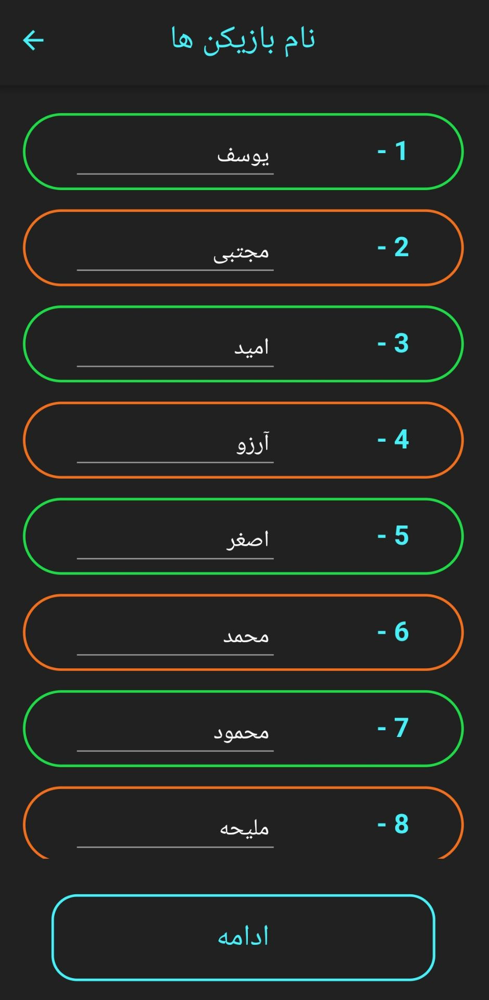
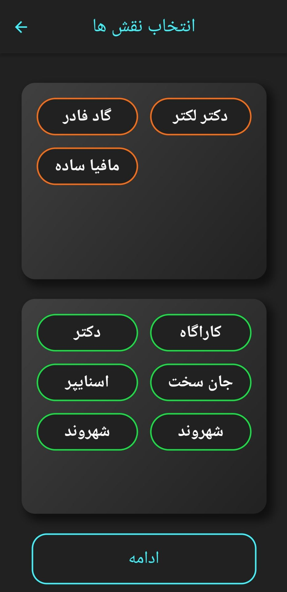
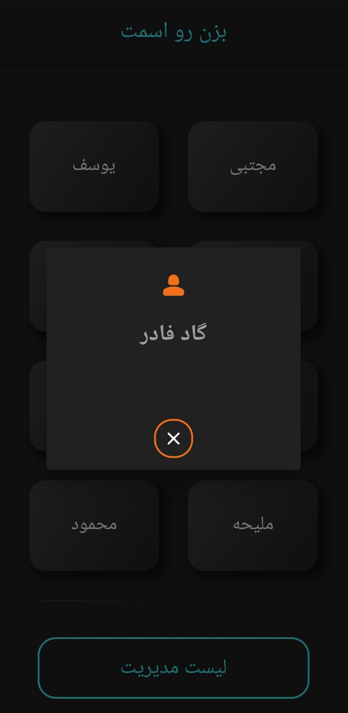

# Mafia Game Manager - Flutter App


Welcome to **Mafia Game Manager**, a Flutter-based Android application that helps you effortlessly organize and manage the popular party game *Mafia*. Whether you're a game master or a player, this app simplifies role assignment, game progression, and player management with a beautiful UI.

---

## 🌐 Features

- 🧛‍♂️ Has two scenarios: Mafia and Godfather.
- 📖 All roles are explained in it.
- 🌐 Has many and varied roles to choose from to play.
- 🧑‍🎓 Customizable player list with names
- 🔫 Ability to expel game members and contains the final stage card
- 🌟 Clean, responsive UI built with Flutter

---

## 🚀 Getting Started

### Prerequisites
- Flutter SDK: [Install Flutter](https://flutter.dev/docs/get-started/install)
- Android Studio or VSCode with Flutter plugin
- Libraries :
  provider: ^6.0.5 |
  stop_watch_timer: ^2.0.0 |
  lottie: ^2.3.1 |
  double_back_to_close_app: ^2.1.0 |
  responsive_grid_list: ^1.3.2 |
  cupertino_icons: ^1.0.2 |


### Installation
```bash
git clone https://github.com/your-username/mafia-game-manager.git
cd mafia-game-manager
flutter pub get
flutter run
```

---

## 💡 How to Play with the App

1. Choose your desired scenario.
2. Select player numbers.
3. Enter all player names.
4. Read the introduction and choose roles.
5. Enhance the scenario's interest by assigning the chosen roles.
6. Show each player's role for theme.
7. Go next page and manage the game.
---

## 📘 Screenshots

<p align="center">
  
  
  
</p>

---

## 🎓 Tech Stack
- **Flutter** & **Dart**
- State management: `Provider` / *(update according to your usage)*
- Material Design
- Work with Lottie animations

---

## 🙏 Contributions
Pull requests are welcome! Feel free to open issues for any bugs or feature suggestions.

---

## 📲 Contact
For any questions, feel free to reach out:
- Email: yousef.yousefian.85@gmail.com
- GitHub: [Yousef Yousefianzadeh](https://github.com/yyzadeh)

---

Let the game begin — and may the best liar win! 🌟
